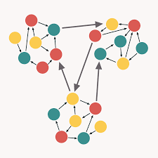

# SOLID란 무엇인가

* TAG: Design Pattern

1. 객체지향에서 지키면 매우 좋은 5가지의 개념들을 약자만 따서 부르는 이름임
2. 사실 학교수업에서 각 개념은 배웠는데 solid라고 들으니 연결이 잘 안됨
3. 그래서 한번 정리하면서 유식해보이게 설명할 수 있도록 solid로 다시 외워보자

## Single Responsibility Principle

객체는 단 하나의 역할만 가져야 한다는 원칙 \
Low Coupling, High Cohesion이라고 배운 내용이 바로 이 내용이다. \
각 요소들 간의 의존관계(Coupling)은 줄이고 비슷한 기능은 최대로 통합하여 객체로 만드는 것



여러 객체들이 explict한 역할을 갖도록 잘 분배한다면, 시스템에 변화가 생기더라도 그 영향을 최소화 할 수 있다.

## Open-Closed Principle

객체는 기존의 코드를 변경하지 않으면서(closed), 기능을 추가할 수 있도록(open) 설계가 되어야 한다. \
관련 개념으로는 캡슐화를 통해 여러 객체에서 사용하는 같은 기능을 인터페이스에 정의하는 방법이 있다. \
위 개념을 잘 지킨다면, 객체가 복잡해져도 쉽게 확장이 가능하다.

## Liskov Substitution Principle

상속 시 부모와 자식의 관계가 반드시 IS-A 관계를 유지하도록, 부모를 치환힐 수 있는 자식을 만들도록 정의함. \
자식 클래스는 부모 클래스의 기능을 무시하거나 재정의하지 않고 확장만 수행해야함. \
Override는 객체지향에서 기술적인 방법이지 LSP의 개념을 수행하기에 적절하지는 못하다.

```java
class Rectangle {
    private int width;
    private int height;

    public void setHeight(int height) {
        this.height = height;
    }

    public int getHeight() {
        return this.height;
    }

    public void setWidth(int width) {
        this.width = width;
    }

    public int getWidth() {
        return this.width;
    }

    public int area() {
        return this.width * this.height;
    }
}

class Square extends Rectangle {
    @Override
    public void setHeight(int value) {
        this.width = value;
        this.height = value;
    }

    @Override
    public void setWidth(int value) {
        this.width = value;
        this.height = value;
    }
}

class Test {
    static boolean checkAreaSize(Rectangle r) {
        r.setWidth(5);
        r.setHeight(4);

        if(r.area() != 20 ){ // Error Size
            return false;
        }

        return true;
    }
    public static void main(String[] args){
        Test.checkAreaSize(new Rectangle()); // true
        Test.checkAreaSize(new Square()); // false
    }
}
```

위와같이 코드를 작성한 경우 Square는 Rectangle의 method인 setHeight와 setWidth를 Override 했지만 \
CheckAreaSize에서 다른 값을 반환하게 됨. 위와 같은 경우는 객체를 상속이 아니라 새롭게 정의해야함.

## Interface Segregation Principle

인터페이스는 사용하지 않는 method을 사용하도록 강제되어서는 안된다. \
SRP는 객체의 단일 책임을 뜻한다면, ISP는 인터페이스의 단일 책임을 의미한다. \
하나의 기능단위로 만든 객체에서 일부씩만 필요한 경우가 있다면, 각각을 interface로 만들어서 \
구체적으로 기능을 분리하는 것이 불필요한 method에 대한 의존을 낮춘다.

## Dependency Inversion Principle

상위 수준의 모듈이 하위 수준의 모듈에 의존하지 말도록, 추상화에 의존하도록 설계하는 원칙이다. \
추상성이 낮은 클래스보다 추상성이 높은 클래스와 의존 관계를 맺어야 한다.

Cat, Dog보다 추상성이 높은 개념인 Animal이 있고, 해당 객체에 LSP와 OCP가 잘 적용되어 있다면 \
다른 객체는 Animal에 의존성을 가져야 한다. 이를 지킬 때 Test 적용에 많은 도움이 된다.
