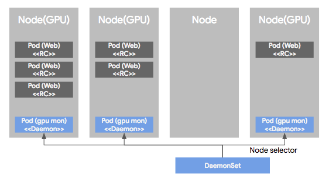
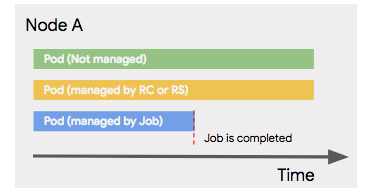
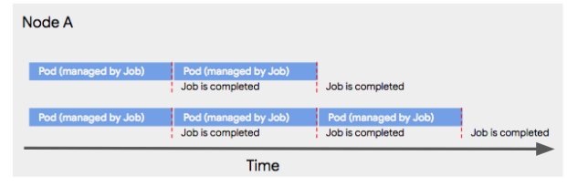

# Kubernetes 정리

* [출처] 조대협님 블로그 <https://bcho.tistory.com/1255?category=731548>
* TAG: Kubernetes

## 개념정리 (고급)

### 고급 컨트롤러

RC, RS, Deployment는 웹 서버등의 일반적인 워크로드에 대해 Pod를 관리하기 위한 컨트롤러이다. \
그러나 실제 환경에서는 DB, Batch, Deamon 등 다양한 형태의 작업이 존재한다. 이를 지원하는 컨트롤러이다.

#### DeamonSet



DeamonSet은 Pod가 각각의 노드에서 하나씩만 돌게 하는 형태로 관리하는 컨트롤러이다. \
RC나 RS에 의해서 관리되는 Pod는 Node의 상황에 따라 균등하지 못하게 배포된다. \
하지만 DeamonSet은 Node Selector로 Node의 라벨을 확인하여 원하는 Node들에 균등하게 하나씩 배포가 가능하다. \
이러한 형태의 배포는 Monitoring, Log Stash의 용도로 사용할때 효과적이다.

#### Job



Batch나 한번 실행되고 끝나는 형태의 작업이 필요한 경우에는 작업당시에만 Pod를 띄우면 된다. \
Job이 관리하는 Pod는 Job의 종료시에 같이 종료된다. Job을 정의할 때는 Job으로 실행할 \ container의 spec 부분에 command를 같이 입력한다.

Job 컨트롤러에 의해서 실행된 Pod는 이때의 command의 실행 결과에 따라서 Job의 성공 실패를 판단한다. \
(Process의 exit을 감지한다.) \
이때 retry / fail은 설정에 따라서 달라진다. 이때는 resume이 아니라 restart로 진행되기 때문에 \
작업을 처음부터 시작해도 데이터에 문제가 발생하지 않는 형태의 프로그램이 수행되어야 한다.



배치 작업의 경우 같은 작업을 연속해서 수행해야 하는경우가 있는데, 이런 경우에도 설정이 가능하다. \
Job을 정의할 때 spec에서 Completion에 횟수를 주면 횟수를 순차적으로 반복한다. \
또 Spec에 parallelism에 동시 실행할 Pod의 수를 주면 completion 횟수를 병렬로 처리한다. \
위 그림은 Completion = 5, parallelism = 2인 경우의 그림이다.

#### Cron jobs

Job 컨트롤러에 의해서 실행되는 배치성 작업을 주기적으로 자동화해서 실행할 필요가 있을 때 \
Cron Jobs 컨트롤러를 사용해서 unix cron 명령어 조건을 spec의 schedule에 정의한다.

```yaml
apiVersion: batch/v1beta1
kind: CronJob
metadata:
  name: hello
spec:
  schedule: "*/1 * * * *"
  jobTemplate:
    spec:
      template:
        spec:
          containers:
          - name: hello
            image: busybox
            args:
            - /bin/sh
            - -c
            - date; echo Hello from the Kubernetes cluster
          restartPolicy: OnFailure

```

#### StatefulSet

DB와 같이 State를 가진 Pod를 지원하기 위한 개념이다. 4장에서 더 깊게 소개할 예정
