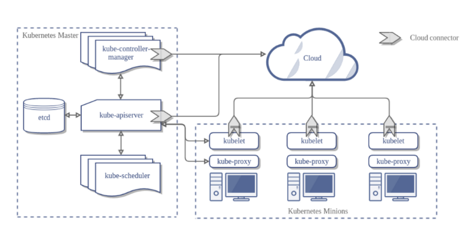
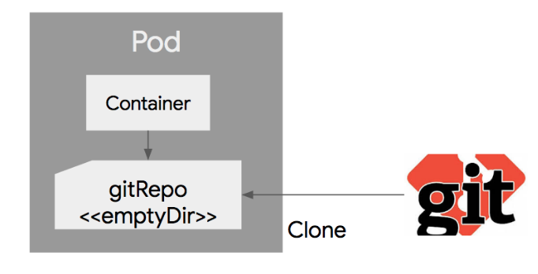
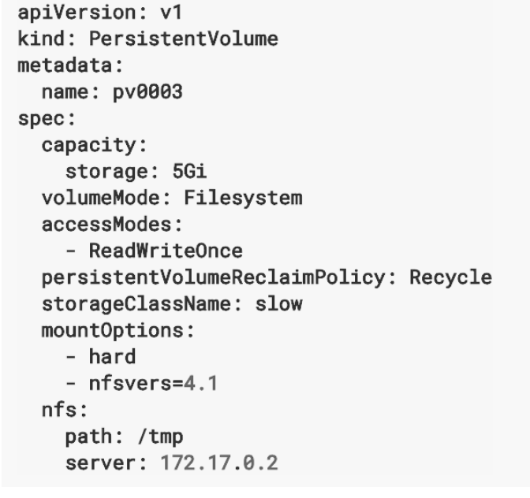
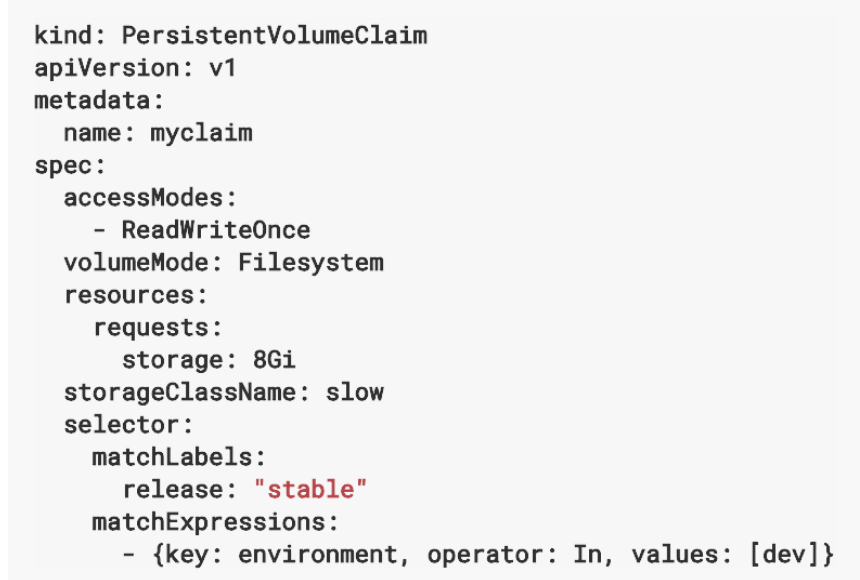
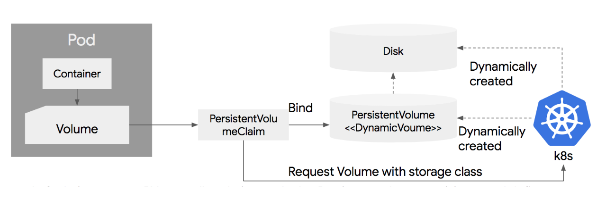
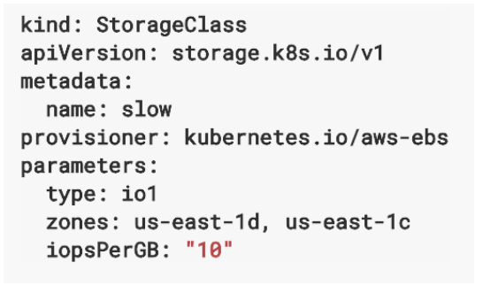

# Kubernetes 정리

* [출처] 조대협님 블로그 <https://bcho.tistory.com/1255?category=731548>
* TAG: Kubernetes

## 아키텍쳐



### 마스터 - 노드 개념

마스터는 쿠버네티스의 설정 환경을 저장하고 전체 클러스터를 관리한다. \
노드는 Pod나 Container처럼 동작하는 워크로드를 호스팅하는 역할을 한다. \
마스터는 API 서버, 스케줄러, 컨트롤러 매니저, etcd로 구성되어있다.

#### 마스터의 구성요소

* API 서버: 쿠버네티스는 모든 명령과 통신을 API를 통해서 한다. K8s의 모든 기능들을 REST API로 제공하고, 그에 대한 명령을 처리한다.

* Etcd: 쿠버네티스 클러스터의 데이터 베이스 역할을 하는 서버로 env config와 클러스터의 state를 저장한다. 이는 분산형 key/value 스토어로 (redis랑 비슷한 느낌인가?) 값들을 공유하여 저장한다.

* 스케줄러: Pod, Service 등의 리소스를 적절한 노드에 할당하는 역할을 한다.

* 컨트롤러 매니저: 컨트롤러 매니저는 RC, SC, VC, NC를 생성하고 이를 각 노드에 배포하며 관리한다.

* DNS: 쿠버네티스는 resource들의 엔드포인트를 DNS로 매핑하고 관리한다. 이렇게 동적으로 생성되는 Pod와 서비스들은 IP를 배정받는데, 내부의 DNS 서버가 동적으로 변경되는 IP를 관리함으로 해결한다.

### 노드의 구성요소

* Kubelet: 노드에 배포되는 에이전트로 API 서버와 통신을 하면서 노드가 수행해야 할 명령을 수행하고 마스터로 노드의 상태를 전달한다.

* Kube-proxy: 노드로 들어오는 트래픽을 적절한 컨테이너로 라우팅하고, 로드밴런싱을 해주면서 통신을 관리한다.

* Container runtime: Pod를 통해 배포된 컨테이너를 실행한다.

* cAdvisor: 각 노드에서 기동되는 모니터링 에이전트로 컨테이너의 state를 수집하여 API 서버로 전달한다.

## 디스크(Volume)

Volume이란 Pod에 종속되는 디스크이다. 그래서 해당 Pod에 존재하는 컨테이너가 공유해서 사용할 수 있는 공간이다.

### 볼륨의 종류

쿠버네티스의 볼륨은 로컬디스크 뿐만 아니라 클라우드에서 제공하는 디스크 볼륨까지 많은 종류를 지원한다. \
간단하게 구분을 하면 임시디스크, 로컬디스크, 네트워크 디스크 등으로 분류할 수 있다.

#### emptyDir

Pod가 생성될때 같이 생성되고, 삭제될때 같이 삭제되는 임시 볼륨이다. \
단 컨테이너는 죽던지 말던지 별 상관없이 계속해서 사용이 가능하다. 얘는 물리적으로 노드에서 할당해주는 \
디스크에 저장이 되는데, emptyDir.medium 필드에 Memory라고 지정해주면 물리디스크가 아닌 메모리에 내용이 저장된다.

```yaml
apiVersion: v1
kind: Pod
metadata:
  name: shared-volumes
spec:
  containers:
  - name: redis
    image: redis
    volumeMounts:
    - name: shared-storage
      mountPath: /data/shared
  - name: nginx
    image: nginx
    volumeMounts:
    - name: shared-storage
      mountPath: /data/shared
  volumes:
  - name : shared-storage
    emptyDir: {}
```

하나의 Pod에 nginx와 redis 컨테이너를 올리고 볼륨을 사용하여 이를 공유하는 설정이다. \
이렇게 지정을 할 경우 nginx와 redis 모두에서 '/data/shared'에 접근을 통해서 파일 공유가 가능하다.

#### hostPath

노드의 로컬 디스크의 경로를 Pod에서 마운트해서 사용한다. \
같은 hostPath에 있는 볼륨은 여러개의 Pod 사이에서 공유되어 사용될 수 있다. \
또한 로컬 디스크에 저장되기 때문에 hostPath의 파일들은 Pod가 삭제되도 여전히 남아있다. \
당연하게도 서로 다른 Node에 있는 Pod는 hostPath를 공유할 수 없다. \
hostPath는 위와 같은 특성으로 노드의 파일 시스템을 접근하는데 유용하다.

#### gitRepo



생성시에 지정된 git repo의 특정 리비전의 내용을 clone을 사용해서 내려받고, 디스크 볼륨으로 만든다. \
물리적으로는 emptyDir이 생성되고, git repo의 내용을 clone으로 받는 방식이다. \
이를 사용하연 스크립트 언어 기반의 코드들은 gitRepo를 사용하여 쉽게 배포할 수 있다.

#### PersistentVolume & PersistentVolumeClaim

인프라에 종속적이지 않게 디스크 볼륨을 사용할 수 있게 하는 개념이다. \
시스템 관리자가 물리적 디스크 생성 후에 PV라는 이름으로 쿠버네티스에 등록하면 개발자가 Pod를 생성할 때 \
볼륨을 정의하고 PVC를 지정하여 관리자가 생성한 PV와 연결한다.


시스템 관리자가 생성한 물리 디스크를 클러스터 내부에 표현한것이 PV이고 이때 여러가지 옵션으로 \
볼륨의 용량, FileMode, Reclaim Policy(재사용 정책), AccessMode(Pod의 동시 접근 정책) \
등을 넣어주고 만들게 된다. \

PV는 생성이 되면 Available 상태가 되고 이때 PVC에 바인딩되면 Bound 상태로 바뀌고 사용된다. \
이때 바인딩된 PVC가 삭제되는 경우 Released 상태로 남아있게 된다. (보관상태)





위 2개의 사진이 각각 PV와 PVC이고 서로 연결되어 Volume으로 사용가능하게 된 관계이다.

#### Dynamic Provisioning

동적 생성 기능은 시스템 관리자가 별도로 디스크를 생성하고 PV를 생성할 필요 없이 PVC를 생성하면 \
이에 맞는 물리 디스크 생성 및 PV 생성을 자동화해주는 기능이다. \
PVC를 정의하면 쿠버네티스 클러스터가 그걸 읽고 물리디스크를 생성하고 PV를 연결한다. \
실 환경에서는 성능에 따라 다양한 디스크(nVME, SSD, HDD, NFS)를 사용할 수 있다.



#### Storage Class



AWS EBS 디스크에 대한 스토리지 클래스에 대한 정의이다. Slow라는 이름으로 클래스를 지정하였다. \
EBS 타입은 io1, GB per IOPS는 10, Zone은 us-east-1d, us-east-1c에 생성하였다. \
이렇게 정의한 클래스는 PVC 정의시에 storageClassName에 적으면 PVC에 연결된다.
